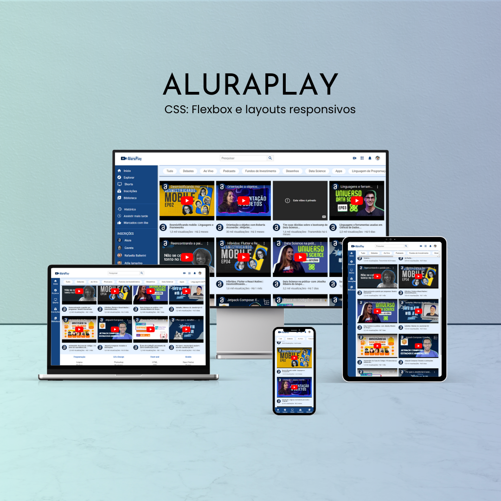

<h1 align="center">✨ AluraPlay ✨</h1>

  <a href="#-tecnologias">Tecnologias</a>&nbsp;&nbsp;&nbsp;|&nbsp;&nbsp;&nbsp;
  <a href="#-projeto">Projeto</a>&nbsp;&nbsp;&nbsp;|&nbsp;&nbsp;&nbsp;
  <a href="#memo-licença">Licença</a>

  

 

## 📖 Descrição

O AluraPlay é uma plataforma de streaming inspirada em serviços de vídeo, que permite aos usuários explorar e assistir a conteúdos sobre diversos temas, como programação, ciência de dados, design e muito mais. O projeto visa proporcionar uma experiência de aprendizado acessível e intuitiva, com uma interface responsiva e fácil de navegar.

## 🚀 Tecnologias

Esse projeto foi desenvolvido com as seguintes tecnologias:

- HTML5
- CSS3
- Git e GitHub

## 💻 Projeto

O AluraPlay oferece uma interface amigável para que os usuários possam navegar por uma variedade de vídeos, com recursos que facilitam a busca e a visualização de conteúdos.

- [Acesse o deploy](https://aluraplay-snowy-pi.vercel.app/)

## 🤝 Contribuições

Contribuições são bem-vindas! Sinta-se à vontade para abrir uma issue ou enviar um pull request.

## :memo: Licença

Esse projeto está sob a licença MIT.

---

Feito com ♥ por [Thalita Noemi](https://www.linkedin.com/in/thalita-noemi/) :wave:
